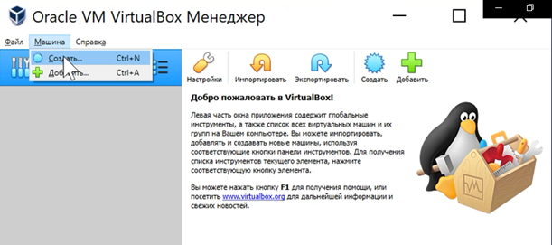

---
## Front matter
title: "Шаблон отчёта по лабораторной работе"
subtitle: "Простейший вариант"
author: "Андриевская Анастасия Андреевна"

## Generic otions
lang: ru-RU
toc-title: "Содержание"

## Bibliography
bibliography: bib/cite.bib
csl: pandoc/csl/gost-r-7-0-5-2008-numeric.csl

## Pdf output format
toc: true # Table of contents
toc-depth: 2
lof: true # List of figures
lot: true # List of tables
fontsize: 12pt
linestretch: 1.5
papersize: a4
documentclass: scrreprt
## I18n polyglossia
polyglossia-lang:
  name: russian
  options:
	- spelling=modern
	- babelshorthands=true
polyglossia-otherlangs:
  name: english
## I18n babel
babel-lang: russian
babel-otherlangs: english
## Fonts
mainfont: PT Serif
romanfont: PT Serif
sansfont: PT Sans
monofont: PT Mono
mainfontoptions: Ligatures=TeX
romanfontoptions: Ligatures=TeX
sansfontoptions: Ligatures=TeX,Scale=MatchLowercase
monofontoptions: Scale=MatchLowercase,Scale=0.9
## Biblatex
biblatex: true
biblio-style: "gost-numeric"
biblatexoptions:
  - parentracker=true
  - backend=biber
  - hyperref=auto
  - language=auto
  - autolang=other*
  - citestyle=gost-numeric
## Pandoc-crossref LaTeX customization
figureTitle: "Рис."
tableTitle: "Таблица"
listingTitle: "Листинг"
lofTitle: "Список иллюстраций"
lotTitle: "Список таблиц"
lolTitle: "Листинги"
## Misc options
indent: true
header-includes:
  - \usepackage{indentfirst}
  - \usepackage{float} # keep figures where there are in the text
  - \floatplacement{figure}{H} # keep figures where there are in the text
---

### **МИНИСТЕРСТВО ОБРАЗОВАНИЯ И НАУКИ РОССИЙСКОЙ ФЕДЕРАЦИИ**
### **ФЕДЕРАЛЬНОЕ ГОСУДАРСТВЕННОЕ АВТОНОМНОЕ ОБРАЗОВАТЕЛЬНОЕ УЧРЕЖДЕНИЕ ВЫСШЕГО ОБРАЗОВАНИЯ**
### **«РОССИЙСКИЙ УНИВЕРСИТЕТ ДРУЖБЫ НАРОДОВ»**

Факультет физико-математических и естественных наук

Кафедра 	прикладной информатики и теории вероятностей	
## **ОТЧЕТ**
## **по лабораторной работе №1**
### дисциплина «Операционные системы»
Выполнил:

Студент группы	НПИбд-01-21	

Студенческий билет № 1032211699

Андриевская Анастасия Андреевна

### **МОСКВА**
2022 г.

## **Цель работы:**
Целью данной работы является приобретение практических навыков установки операционной системы на виртуальную машину, настройки минимально необходимых для дальнейшей работы сервисов.
## **Ход работы:**
1.	Я создала виртуальную машину
    1. Для создания виртуальной машины в VirtualBox я выбрала Машина / Создать (рис 1.1).
    

        Рисунок 1.1. Создание виртуальной машины
    2. Я указала имя виртуальной машины (ваш логин в дисплейном классе), тип операционной системы — Linux, Fedora (рис. 1.2).
   
        

        Рисунок 1.2. Указание имени ВМ и типа ОС

    3. Я указала размер основной памяти виртуальной машины — 4096 МБ. Задала конфигурацию жёсткого диска — загрузочный, VDI (BirtualBox Disk Image), динамический виртуальный диск. Задала размер диска — 80 ГБ, его расположение — в моем случае F:\VitualBox\fedora\fedora.vdi (рис 1.3)
   
        

        Рисунок 1.3. Указание размера памяти, конфигурации, размера и расположения диска
2. Я добавила новый привод оптических дисков и выбрала образ afs dk.sci.pfu.edu.ru common files iso Fedora-Workstation-Live-x86_64-35-1.2.iso, который заведомо скачала с официального сайта Fedora (рис.2).

    Рисунок 2. Установка оптического привода
3. Я выполнила настройки виртуальной машины перед ее использованием.
    1. Я указала в качестве общего буфера обмена и функции Drag and Drop – двунаправленный (рис.3.1).

        Рисунок 3.1. Общие настройки
    2. Я дала виртуальной машине доступ двум ядрам процессора (рис. 3.2).

        

        Рисунок 3.2. Настройки системы
    3.	Я дала виртуальной машине доступ к 128 МБ видеопамяти и включила режим 3D ускорению (рис. 3.3).

        

        Рисунок 3.3. Настройки дисплея
4. Я запустила виртуальную машину. Далее я выбрала язык интерфейса и перешла к настройкам установки операционной системы (рис. 4.)

    

    Рисунок 4. Окно настройки установки образа ОС
5. Я выбрала в качестве места установки диск ATA VBOX HARDDICK (рис.5).
   
    

    Рисунок 5. Окно настройки: место установки
6. После завершения установки операционной системы я корректно перезапустила виртуальную машину (рис.6).
    
    

    Рисунок 6. Перезапуск ВМ
7. Я вручную изъяла носитель информации с образом (рис.7). После я вновь запустила виртуальную машину.
   
    

    Рисунок 4. Изъятие диска из привода
8. Я ввела информацию о пользователе данной учётной записи (рис. 8).

    

    Рисунок 8. Окно конфигурации пользователей
9.	Я установила пароль для пользователя.

    

    Рисунок 5. Установка пароля для пользователя

## **Выводы:** я приобрела практические навыки установки операционной системы на виртуальную машину, настройки минимально необходимых для дальнейшей работы сервисов.

## **Отчет о выполнении дополнительного задания:**
С помощью команды dmesg и некоторых других команд я получила через терминал следующую информацию:
1.	Версия ядра Linux (Linux version) (рис. 10).
Команда: dmesg | grep -i "Linux version"

    

    Рисунок 10. Версия ядра Linux
2.	Частота процессора (Detected Mhz processor) (рис.11).
Команда: sudo dmesg | grep -i " MHz"

    

    Рисунок 6. Частота процессора
3.	Модель процессора (CPU0) (рис.12).
Команда: dmesg | grep -i "CPU0"

    

    Рисунок 7. Модель процессора
4.	Объем доступной оперативной памяти (Memory available) (рис. 13).
Команда: free -h

    

    Рисунок 13.  Объем доступногй оперативной памяти
5.	Тип обнаруженного гипервизора (Hypervisor detected) (рис.14).
Команда: dmesg | grep -i "Hypervisor detected"

    

    Рисунок 14. Тип обнаруженного гипервизора
6. Тип файловой системы корневого раздела (рис.15).
Команда: df -t

    

    Рисунок 15. Тип файловой системы корневого раздела
7.	Последовательность монтирования файловых систем (рис.16).
Команда: df -h

    

    Рисунок 16. Последовательность монтирования файловых систем

## **Ответы на контрольные вопросы:**
*1.Какую информацию содержит учётная запись пользователя?*

Системное имя, идентификатор пользователя и группы, полное имя, домашний каталог и начальная оболочка.

*2. Укажите команды терминала и приведите примеры:*

*– для получения справки по команде;*

Ls. Например, man ls

*– для перемещения по файловой системе;*

Cd. Например, Cd/dev

*– для просмотра содержимого каталога;*

Ls. Например, ls / (содержимое корневого каталога)

*– для определения объёма каталога;*

Du -s. Например, du -s /home

*– для создания каталогов;*

Mkdir. Например, mkdir A

*- для удаления каталогов;*

Mrdir -s – для пустых, Mrdir -r – для непустых. Например, Mrdir -s А.

*- для создания файлов*

Touch. Например, touch file.txt

*- для удалния файлов*

Rm. Например, rm file.txt

*– для задания определённых прав на файл;*

Chmod. Например, chmod 744 file.txt

*– для просмотра истории команд.*

History

*3.	Что такое файловая система? Приведите примеры с краткой характеристикой.*

Файловая система – это архитектура хранения данных, которые могут храниться в разделах жесткого дика и ОП. Например, XFS. Файловая система рассчитана на файлы большого размера.

*4.	Как посмотреть, какие файловые системы подмонтированы в ОС?*

Команда mount, df -h

*5.	Как удалить зависший процесс?*

Команда kill …(номер процесса). Чтобы узнать номер процесса, воспользуемся командой ps axu | grep …(название процесса)

## **Список литературы:**
URL: https://git-scm.com/book/ru/v2/

URL: https://smartiqa.ru/courses/git/lesson-3

URL:
https://esystem.rudn.ru/pluginfile.php/1383438/mod_resource/content/4/002-lab_vcs.pdf